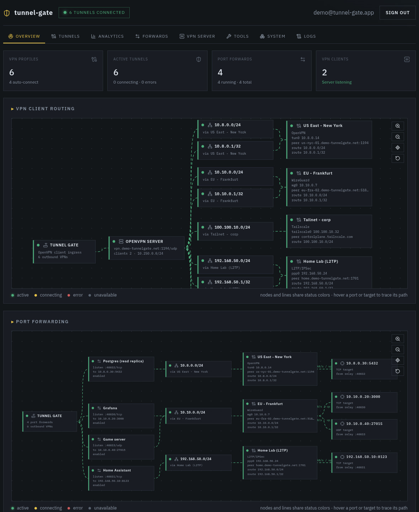

# tunnel-gate

Reach several internal networks (corp VPN, home lab, a WireGuard peer, a
Tailscale net) without running any of those VPN clients on your machine.

Give tunnel-gate your VPN profiles and it dials each one inside its own isolated
Docker worker. The internal networks come back to you as plain port forwards, or
through a single OpenVPN profile that reaches all of them at once.



## What it does

OpenVPN, WireGuard, L2TP/IPSec, Tailscale, and NetBird can all be connected at
the same time, including multiple L2TP connections that normally can't coexist
on one host. Each profile runs in its own network and process namespace, so
nothing collides.

There are two ways to actually reach the networks.

- **One OpenVPN profile for everything.** Turn on the built-in OpenVPN server and
  it merges the subnets of every connected VPN behind one `.ovpn` file. Import it
  once and your machine can talk to all of them over a single connection.
- **Port forwarding.** Map a host port to something on the far side, like
  `:40000/tcp` to `10.1.2.3:22`, then `ssh -p 40000 user@relay-host`. No changes
  to the client's routing.

## How it works

You talk to the controller (the console and the relay). When you connect a
profile, the controller starts a worker container for it. The worker owns the
VPN process, credentials, DNS, firewall/NAT rules, and traffic counters, all
sealed in its own namespace. The controller installs that profile's target CIDRs
as routes pointing at the worker, so traffic for those subnets goes into the
right tunnel.

Since every profile is a separate worker, you can run as many as you want.
Orphaned workers from a crashed controller get cleaned up on boot, and a
watchdog redials any worker that dies.

## Quick start

Needs Docker with the Compose plugin. For L2TP the host needs `ppp_generic`
loaded (`sudo modprobe ppp_generic`).

```sh
cp .env.example .env
docker compose -f docker-compose.prod.yaml up -d
```

This pulls the published image. To build locally instead, use the default
`docker compose up --build -d`.

Open http://localhost:3000. The first account you create becomes the admin, and
sign-up closes afterward (reopen it with `ALLOW_SIGNUP=true`).

From there, add a profile under Tunnels and connect it (or enable Auto for
connect-on-boot), then reach the network with a port forward or the built-in
OpenVPN server.

## Configuration

Everything is configured through environment variables. See `.env.example` for
the full list and defaults.

## Development

Open the repo in VS Code and "Reopen in Container". It builds the same image
(Bun, Docker CLI, VPN tooling) with `NET_ADMIN`, `/dev/net/tun`, and the host
Docker socket, and reuses the PostgreSQL service from `docker-compose.yaml`.

```sh
bun install
bun run dev        # server :3000 + web :5173 (vite, proxies /api)
bun run test       # unit tests
bun run typecheck  # strict TypeScript
bun run format:fix # Biome formatting
```

Outside the dev container, run `docker compose up -d postgres` and point
`DATABASE_URL` at
`postgresql://tunnel_gate:<password>@localhost:5432/tunnel_gate?schema=public`.
Anything tunnel-related needs root plus `NET_ADMIN`; auth and profile CRUD work
anywhere. Prisma migrations run on boot.

## Security notes

- The controller mounts `/var/run/docker.sock`, which is effectively host-root
  access. Keep auth enabled and don't expose the console to untrusted users.
